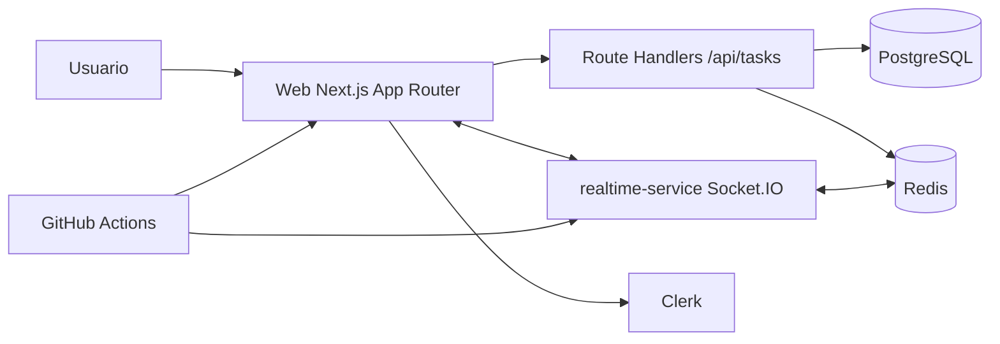

# PulseBoard Kanban Linear

[Producción](https://pulseboard-kanban-linear.vercel.app) · [Repositorio](https://github.com/Articrafter93/2-pulseboard-kanban-linear)

PulseBoard es un tablero Kanban colaborativo inspirado en Linear, con persistencia real en PostgreSQL, sincronización en tiempo real sobre Socket.IO+Redis, autenticación con Clerk (o modo `mock` para desarrollo), rate limiting y pruebas E2E con Playwright.

## Estado actual
- Auth y protección de rutas: `middleware.ts` + páginas `/signin` y `/signup`.
- Board persistente: creación y movimiento de tareas en DB (Prisma).
- Realtime productivo: sync de tareas, presencia y cursor colaborativo.
- Hardening: validación runtime de entorno con Zod + rate limiting en API y sockets.
- Performance: virtualización por columna con `@tanstack/react-virtual`.
- QA: CI con `lint`, `build`, `realtime:build` y `test:e2e`.

## Arquitectura


## Estructura del repositorio
- `app/`: App Router, UI y Route Handlers.
- `components/`: UI shared + board virtualizado/dnd.
- `lib/`: env, auth runtime, rate limit, mapeos de dominio.
- `shared/realtime-events.ts`: contratos tipados compartidos web/realtime.
- `prisma/`: schema, seed y utilidades de DB.
- `realtime-service/`: servicio Socket.IO con Dockerfile propio.
- `tests/e2e/`: pruebas Playwright (auth, persistencia, realtime).
- `artifacts/lighthouse/`: reportes de Lighthouse en producción.

## Variables de entorno
Usar `.env.example` como plantilla base.

| Variable | Requerida | Uso |
|---|---|---|
| `NODE_ENV` | Sí | Entorno Node |
| `NEXT_PUBLIC_APP_NAME` | Sí | Nombre público de app |
| `NEXT_PUBLIC_APP_URL` | Sí | URL pública web |
| `NEXT_PUBLIC_REALTIME_SERVICE_URL` | Sí | URL pública del servicio realtime |
| `REALTIME_SERVICE_URL` | Sí | URL interna/servidor para realtime |
| `REALTIME_PORT` | Sí | Puerto del servicio realtime |
| `DATABASE_URL` | Sí | Conexión Prisma/PostgreSQL |
| `DIRECT_URL` | Opcional | URL directa para migraciones Prisma |
| `REDIS_URL` | Sí | Redis para adapter + rate limits |
| `NEXT_PUBLIC_AUTH_PROVIDER` | Sí | `mock` o `clerk` |
| `MOCK_DB_ENABLED` | Sí | `true` o `false` |
| `CLERK_SECRET_KEY` | Condicional | Obligatoria cuando `NEXT_PUBLIC_AUTH_PROVIDER=clerk` |
| `NEXT_PUBLIC_CLERK_PUBLISHABLE_KEY` | Condicional | Obligatoria cuando `NEXT_PUBLIC_AUTH_PROVIDER=clerk` |
| `NEXT_PUBLIC_CLERK_SIGN_IN_URL` | Sí | Ruta pública de login |
| `NEXT_PUBLIC_CLERK_SIGN_UP_URL` | Sí | Ruta pública de registro |
| `RATE_LIMIT_API_WINDOW_MS` | Sí | Ventana de rate limit HTTP |
| `RATE_LIMIT_API_MAX` | Sí | Máximo requests HTTP por ventana |
| `RATE_LIMIT_SOCKET_WINDOW_MS` | Sí | Ventana de rate limit WS |
| `RATE_LIMIT_SOCKET_MAX` | Sí | Máximo eventos WS por ventana |

## Setup local paso a paso
1. Instalar dependencias.
```bash
npm install
npm --prefix realtime-service install
```

2. Crear entorno local.
```bash
cp .env.example .env.local
```

3. Levantar infraestructura base (PostgreSQL + Redis).
```bash
docker compose up -d db redis
```

4. Preparar DB.
```bash
npm run prisma:generate
npm run prisma:push
npm run prisma:seed
```

5. Ejecutar web + realtime.
```bash
npm run dev
npm run realtime:dev
```

6. URLs locales.
- Web: `http://localhost:3000`
- Realtime health: `http://localhost:4001/health`

## Docker
### Web
```bash
docker build -t pulseboard-web .
```

### Realtime (servicio independiente)
```bash
docker build -t pulseboard-realtime ./realtime-service
```

### Stack completo
```bash
docker compose up --build
```

## APIs y eventos
### HTTP
- `GET /api/tasks`
- `POST /api/tasks`
- `PATCH /api/tasks/:taskId/move`

### Socket.IO
- Cliente -> servidor: `workspace:join`, `task:moved`, `presence:cursor`
- Servidor -> clientes: `task:moved`, `presence:joined`, `presence:left`, `presence:cursor`

Payloads compartidos en `shared/realtime-events.ts` para evitar drift entre cliente y servidor.

## UX de carga y error por ruta
Se implementaron boundaries `loading.tsx` y `error.tsx` en rutas críticas del workspace:
- `/app/w/[workspaceId]/board`
- `/app/w/[workspaceId]/list`
- `/app/w/[workspaceId]/reports`
- `/app/w/[workspaceId]/activity`
- `/app/w/[workspaceId]/calendar`
- `/app/w/[workspaceId]/task/[taskId]`

## Virtualización y performance del board
- Dependencia: `@tanstack/react-virtual` en `package.json`.
- Implementación activa en `components/board-view.tsx` vía `useVirtualizer`.
- Objetivo: mantener DOM acotado y scroll fluido en columnas con 100+ tareas.

## Testing y CI
### Local
```bash
npm run lint
npm run build
npm run realtime:build
npm run test:e2e
```

### E2E incluidos
- `tests/e2e/auth.spec.ts`
- `tests/e2e/board-persistence.spec.ts`
- `tests/e2e/realtime-sync.spec.ts`

### Pipeline
`/.github/workflows/ci.yml` bloquea merge si falla cualquier etapa.

## Lighthouse en producción (Vercel)
Comando reproducible:
```bash
npm run lighthouse:prod
```

Artefactos versionados:
- `artifacts/lighthouse/production-2026-03-14.report.html`
- `artifacts/lighthouse/production-2026-03-14.report.json`
- `artifacts/lighthouse/production-2026-03-14.report.summary.json`

Scores reales (`fetchTime: 2026-03-14T05:46:25Z`, URL auditada `https://pulseboard-kanban-linear.vercel.app/`):
- Performance: `99`
- Accessibility: `100`
- Best Practices: `96`
- SEO: `100`

Cumplimiento de umbrales solicitados:
- Performance `>= 85`: OK
- Accessibility `>= 90`: OK
- Best Practices `>= 90`: OK

## Notas operativas
- El script `scripts/run-lighthouse.mjs` prioriza Lighthouse CLI y, por estabilidad en Windows, recupera el reporte generado aunque el proceso termine con `EPERM` al limpiar carpeta temporal de Chrome.
- Si falla CLI sin reporte válido, hace fallback a PageSpeed Insights.
