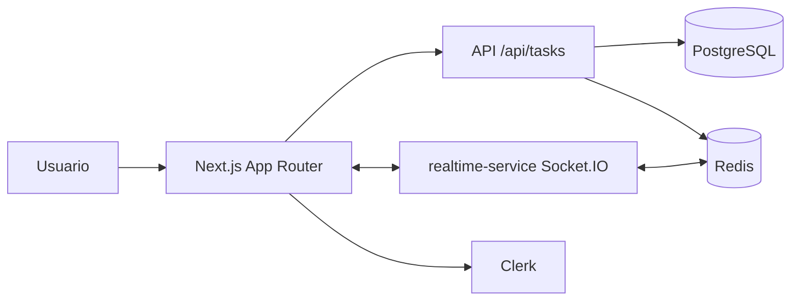

# Pulseboard Kanban Linear

Pulseboard es un tablero Kanban colaborativo inspirado en la experiencia de Linear: rápido, ordenado y con colaboración en tiempo real.

## Producción
- URL canónica: https://pulseboard-kanban-linear.vercel.app

## Repositorio
- GitHub: https://github.com/Articrafter93/2-pulseboard-kanban-linear

## Estado de la entrega
- Auth: Clerk (signin/signup y protección de rutas `/app/**`).
- Board: persistencia real en PostgreSQL con Prisma.
- Realtime: servicio Socket.IO separado con Redis adapter, presencia y cursores.
- Seguridad operativa: validación fail-fast de variables de entorno + rate limiting en API y sockets.
- QA: suite Playwright E2E y pipeline CI obligatorio.

## Arquitectura


## Repositorio y servicios
- `app/`: frontend + route handlers Next.js.
- `realtime-service/`: servicio Socket.IO independiente (tiene su propio `Dockerfile`).
- `prisma/schema.prisma`: modelo de datos.
- `shared/realtime-events.ts`: contratos tipados compartidos de eventos realtime.

## Variables de entorno
Usa `.env.example` como plantilla. Variables críticas (obligatorias en runtime):

| Variable | Uso |
|---|---|
| `DATABASE_URL` | Conexión Prisma a PostgreSQL |
| `REDIS_URL` | Rate limiting y adapter realtime |
| `CLERK_SECRET_KEY` | Auth server-side |
| `NEXT_PUBLIC_CLERK_PUBLISHABLE_KEY` | Auth client-side |
| `NEXT_PUBLIC_REALTIME_SERVICE_URL` | URL pública del servicio Socket.IO |
| `NEXT_PUBLIC_APP_URL` | URL base de la app |
| `NEXT_PUBLIC_AUTH_PROVIDER` | `mock` (local sin Clerk) o `clerk` (auth real) |

## Setup local paso a paso
1. Instalar dependencias:
```bash
npm install
npm --prefix realtime-service install
```

2. Configurar entorno:
```bash
cp .env.example .env.local
```

3. Levantar PostgreSQL y Redis (Docker Desktop):
```bash
docker compose up -d db redis
```

4. Preparar base de datos:
```bash
npm run prisma:generate
npm run prisma:push
npm run prisma:seed
```

5. Ejecutar servicios:
```bash
npm run dev
npm run realtime:dev
```

6. Abrir:
- Web: `http://localhost:3000`
- Realtime health: `http://localhost:4001/health`

## Docker
### Web
```bash
docker build -t pulseboard-web .
```

### Realtime (Dockerfile propio)
```bash
docker build -t pulseboard-realtime ./realtime-service
```

### Compose local
```bash
docker compose up --build
```

## Testing
### Lint y build
```bash
npm run lint
npm run build
npm run realtime:build
```

### E2E (Playwright)
```bash
npm run test:e2e
```

Variables opcionales para pruebas completas de login/sincronización multiusuario:
- `E2E_CLERK_EMAIL`
- `E2E_CLERK_PASSWORD`
- `E2E_CLERK_EMAIL_2`
- `E2E_CLERK_PASSWORD_2`

## Lighthouse en producción
Generación de artefactos:
```bash
npm run lighthouse:prod
```

Salida esperada:
- `artifacts/lighthouse/production-YYYY-MM-DD.report.html`
- `artifacts/lighthouse/production-YYYY-MM-DD.report.json`

## CI obligatorio
`/.github/workflows/ci.yml` ejecuta:
1. Lint
2. Build web
3. Build realtime
4. Playwright E2E

Si alguna etapa falla, el merge debe bloquearse.
